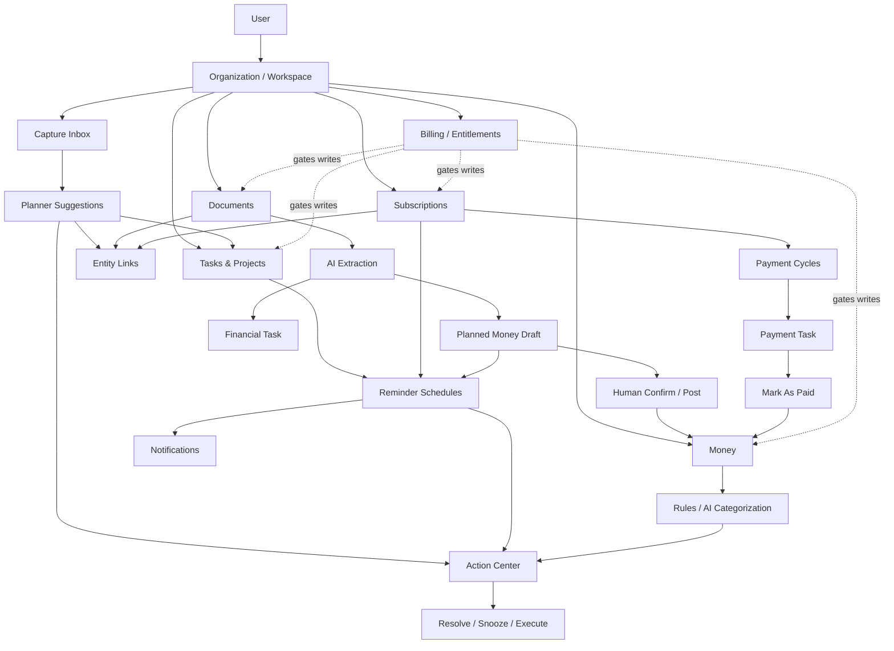

# Nevora Business OS: Product & Architecture Report

Дата: 2026-07-08  
Роль анализа: Senior Product Architect / CTO / Product Critic  
Метод: чтение README/docs, App Router routes, модулей `modules/`, `features/`, `lib/`, Supabase migrations, cron routes, navigation, billing/security code. Unit suite: `npm test` passed — 139 files passed, 1 skipped; 792 tests passed, 3 skipped.

## 1. О чем проект

**Коротко для инвестора / пользователя:** Nevora Business OS — multi-tenant SaaS для малого бизнеса, который связывает задачи, деньги, документы, подписки, уведомления, Action Center и AI-подсказки в один рабочий контур. Ценность не в отдельных CRUD-экранах, а в том, что документ, платеж, задача, подписка и рекомендация могут превращаться друг в друга через подтверждаемые workflow.

**Техническо-продуктово:** Это modular monolith на Next.js 16 + Supabase/Postgres/RLS, где App Router страницы являются композиционным слоем, доменная логика живет в `modules/*`, доступ определяется через `requireOrg()` / `requireAppAccess()`, а кросс-модульные связи строятся через `entity_links`, `domain_events`, `action_items`, notifications и cron sweeps.

**Аудитория:** solo founders, фрилансеры, агентства, small teams, SMB operators, которым нужен легкий операционный слой вместо набора disconnected tools.

**Тип продукта:** Business OS + workflow system + SMB SaaS. Не чистый CRM/ERP, не автономный AI agent. AI здесь ассистент: extraction, insights, recommendations, categorization suggestions, capture intent detection.

**Основные зоны ответственности:**

| Зона | Что делает | Признаки в проекте |
|---|---|---|
| Core tenant/auth | user, organization, workspace, roles, active org | `lib/auth/require-org.ts`, `proxy.ts`, migrations `001-003` |
| Work execution | tasks, projects, financial tasks | `features/todos/*`, `modules/tasks/*`, migrations `055/056/060/064/079` |
| Finance | accounts, transactions, transfers, categories, rules, AI categorization, FX | `modules/moneyflow/*`, migrations `041/049/050/057/067/069/070` |
| Documents | notes/files/private uploads, AI extraction, financial data, obligations | `modules/documents/*`, `app/api/documents/*`, migrations `039/051/052` |
| Recurring spend | subscriptions, payment cycles, payment tasks, mark-as-paid | `modules/subtracker/*`, migration `078` |
| Orchestration | Action Center, entity relations, notifications, reminders, automation | `modules/action-center/*`, `modules/relations/*`, `modules/notifications/*`, `modules/automation/*`, migrations `047/048/073-075/082-085` |
| Capture / AI intake | text capture -> suggestions -> accepted business entity | `modules/planner/*`, `/dashboard/inbox`, migration `080` |
| SaaS monetization | trials, limits, billing state, checkout boundary, provider webhook boundary | `modules/billing/*`, `lib/security/require-app-access.ts`, migrations `071/072/086/089/092` |
| Paused secondary scope | CRM and Booking guarded for beta | `shared/config/paused-modules.ts`, CRM/Booking dashboard routes |

## 2. Цель проекта

Основная цель: дать малому бизнесу один операционный workspace, где пользователь видит, что требует внимания, и переводит сигналы в действия: оплатить, подтвердить расход, обработать документ, закрыть задачу, проверить подписку, принять AI-предложение.

| Горизонт | Цель |
|---|---|
| Краткосрочно | Стабилизировать ядро Tasks + Money + Documents + Subscriptions + Action Center + Inbox + Settings/Billing для private beta. |
| Долгосрочно | Стать SMB operating layer: система сама собирает сигналы, предлагает следующие действия, но критичные финансовые изменения оставляет за человеком. |
| Стратегическая ценность | Data substrate для AI: события, связи, действия и финансовые контексты создают больше ценности, чем отдельные таблицы. |
| Отличие от CRUD | Документ может создать draft transaction/action item/financial task; подписка создает payment cycle/task; reminders создают attention items; AI создает reviewable suggestions, а не факты. |

## 3. Какие проблемы решает

| Проблема | Для кого | Как проявляется | Как проект решает | Оценка решения |
|---|---|---|---|---|
| Разрозненные задачи, деньги и документы | SMB operator | Инвойс в файлах, оплата в банке, задача в другом tool | `entity_links`, document extraction, financial tasks, Action Center | Сильно, но UX связей еще требует полировки |
| Потеря обязательств и сроков | Владельцы, ops | Подписки/счета забываются до списания | subscription cycles, financial tasks, reminder schedules, notifications | Хорошо; зависит от cron/env |
| Ручной ввод финансовых документов | Solo/finance ops | Чеки/инвойсы переписываются вручную | document OCR -> normalized data -> planned draft -> confirm | Сильный workflow; нужен reliability/backoff и account/currency UX |
| Непонятно, что делать дальше | Команды | Много записей, нет единого приоритета | Action Center normalizes signals into `action_items` | Перспективно; генерация на page load пока MVP |
| Неконтролируемые AI-действия | SMB с финансовыми данными | AI может “слишком много” сделать сам | AI suggestions require review; no direct posted transaction path | Очень сильная инварианта |
| Биллинг/лимиты для SaaS | Founder/team | Trial abuse, overuse, unpaid org writes | entitlement gate, usage counters, trial claims, provider boundary | Хороший фундамент; self-serve checkout не готов |
| Multi-tenant безопасность | SaaS | Риск IDOR/cross-org leak | RLS, `requireOrg`, `requireAppAccess`, scoped RPCs | Сильнее среднего MVP; нужны DB/E2E regression tests |
| Capture хаоса | Busy operators | “Напомни оплатить X” остается в голове/chats | `/dashboard/inbox`: text capture -> AI suggestion -> task/reminder/link/action | Хороший новый core, но text-first |

## 4. Key Workflows

### Workflow: Organization / Tenant Context

**Цель:** дать каждому пользователю безопасный org/workspace context.  
**Участники:** user, organization, workspace, membership, role.  
**Сущности:** `organizations`, `workspaces`, `memberships`, profile, permissions.  
**Сценарий:** user проходит auth -> `requireOrg()` выбирает active membership -> проверяет selected org cookie как подсказку, не как источник правды -> строит `CurrentContext` -> Server Components/Actions используют `ctx.org.id`.  
**Результат:** все доменные запросы scoped by org/workspace; org-less user идет в onboarding.  
**Связанные процессы:** every mutation, billing, settings, invites.  
**Риски:** central blast radius: ошибка в `requireOrg()` или RLS заденет весь продукт.

### Workflow: Capture Inbox -> AI Suggestion -> Business Entity

**Цель:** превратить сырой текст пользователя в проверяемое действие.  
**Участники:** user, AI, Action Center.  
**Сущности:** `planner_entries`, `planner_suggestions`, `todos`, `entity_links`, `action_items`.  
**Сценарий:** user пишет capture -> `processPlannerEntry()` делает intent detection -> создает pending suggestions -> Action Center получает review item -> user accepts/edits/rejects -> accept routes only to existing services (`createStandardTask`, `createFinancialTask`, `createEntityLink`, `createActionItemForDocument`).  
**Результат:** появляется task/financial task/link/action item; suggestion marked accepted after entity exists.  
**Связанные процессы:** tasks, financial obligations, relations, action center.  
**Риски:** MVP поддерживает не все suggestion types (`create_document`, `assign_project`, `create_project` safely refused); text-first capture.

### Workflow: Task / Project / Financial Task

**Цель:** вести работу и обязательства.  
**Участники:** user, assignees, system.  
**Сущности:** `todos`, `projects`, `task_assignees`, due-date history, financial context columns.  
**Сценарий:** user creates task -> assigns/project/status/due date/comments -> financial tasks can be created from documents/subscriptions/inbox -> due reminders surface attention.  
**Результат:** standard work items and financial obligations share one task substrate.  
**Связанные процессы:** reminders, subscriptions, documents, Action Center, Money mark-as-paid.  
**Риски:** UI create path still uses legacy `features/todos/actions/create-todo.action.ts` with `checkPlanLimit`, while newer headless services use atomic reservation.

### Workflow: Money Transaction / Categorization

**Цель:** учесть доходы/расходы и снизить ручную категоризацию.  
**Участники:** user, AI/rules, system.  
**Сущности:** `money_accounts`, `money_transactions`, `money_categories`, `money_category_rules`, `money_ai_suggestions`.  
**Сценарий:** user creates transaction -> usage reservation -> posted/planned status -> if uncategorized, rule/AI categorization runs after response -> user reviews suggestions/rules.  
**Результат:** posted facts affect balance; planned entries stay forecast-only.  
**Связанные процессы:** documents, subscriptions, action center, analytics, FX.  
**Риски:** FX rates require populated `exchange_rates`; no visible rate-management UI found.

### Workflow: Document Upload -> Extraction -> Draft Expense -> Human Confirmation

**Цель:** убрать ручной ввод чеков/инвойсов без автопостинга.  
**Участники:** user, AI, system, Action Center.  
**Сущности:** `documents`, `document_attachments`, `document_extractions`, `financial_document_data/items`, `money_transactions`, `entity_links`, `action_items`.  
**Сценарий:** document/file uploaded -> extraction job pending/processing -> route extractor + AI normalization -> persist financial data -> create `status='planned'` draft transaction if confidence allows -> link document->transaction -> create Action Center review -> user confirms -> transaction becomes `posted`.  
**Результат:** financial document becomes a reviewable money draft and possibly a financial task.  
**Связанные процессы:** Money, Action Center, notifications, financial tasks.  
**Риски:** depends on Anthropic/OCR/storage/cron; failure states are handled but production observability matters.

### Workflow: Subscription Payment Cycle

**Цель:** recurring spend becomes actionable and auditable.  
**Участники:** user, cron, system.  
**Сущности:** `subscriptions`, `subscription_payment_cycles`, `todos`, `money_transactions`, `entity_links`.  
**Сценарий:** subscription created/renewed -> payment cycle planned -> payment task opens if enabled -> user marks paid/skips/changes due date -> `mark_subscription_payment_paid` RPC atomically creates expense, marks cycle paid, completes task, advances next cycle -> daily sweep repairs missing cycles/tasks.  
**Результат:** recurring payment becomes posted transaction only after explicit mark-as-paid.  
**Связанные процессы:** Money, Tasks, Reminders, Action Center.  
**Риски:** recurrence/date math and cron config; side effects are best-effort after atomic core.

### Workflow: Action Center / Reminders / Notifications

**Цель:** собрать “что требует внимания” в один поток.  
**Участники:** user, system, cron.  
**Сущности:** `action_items`, `action_item_events`, `action_item_links`, `reminder_schedules`, `notifications`, deliveries.  
**Сценарий:** events/scanners/extraction/reminders create action items -> priority engine scores -> in-app notification stored, push delivered if allowed -> user snoozes/dismisses/resolves/executes.  
**Результат:** единый attention feed with counters and activity.  
**Связанные процессы:** tasks, subscriptions, documents, money, planner.  
**Риски:** `syncActionItems()` still runs best-effort on Action Center page load; mature version should be event/cron/queue first.

### Workflow: Billing / Trial / Provider Boundary

**Цель:** SaaS gating, trial abuse prevention, paid-state integrity.  
**Участники:** user/admin, billing provider webhook, system.  
**Сущности:** `plans`, `billing_subscriptions`, `plan_limits`, `organization_usage_counters`, `billing_trial_claims`, `billing_provider_events/mappings`.  
**Сценарий:** onboarding creates trial -> `requireAppAccess()` checks role + entitlement + plan limits -> create actions reserve usage where migrated -> checkout route asks billing provider -> provider webhook applies trusted state via service-role-only RPC.  
**Результат:** writes are blocked for expired/unpaid states; paid activation cannot be faked by dashboard action.  
**Связанные процессы:** every create/write action, settings billing, plans.  
**Риски:** provider adapter is not connected; plans page is comparison-only; legacy `checkPlanLimit` remains for some paths.

### Workflow: Public Booking

**Цель:** optional public appointment request flow.  
**Участники:** anonymous client, host/service, system.  
**Сущности:** booking pages, hosts, services, availability, requests.  
**Сценарий:** public page loads only if `public_enabled` -> client selects host/service/slot -> public API rate-limits by IP/org slug, validates Zod/honeypot, resolves internal IDs server-side via RPC.  
**Результат:** booking request created.  
**Связанные процессы:** notifications/email/CRM direction.  
**Риски:** dashboard booking is beta-gated; public booking is a secondary product line and may dilute focus unless positioned explicitly.

## 5. Связь между процессами

Текстовая схема: organization context scopes everything. Documents and Inbox create suggestions, not final facts. Suggestions flow into Tasks, Financial Tasks, Relations or Action Center. Subscriptions create payment cycles and tasks; explicit payment creates Money transaction and links back. Money categorization and document extraction create review items. Reminder schedules and notifications surface obligations without resolving them. Billing access state gates writes across modules. Paused CRM/Booking exist but are not active Business OS core.

## 6. Архитектурное понимание

**Bounded contexts:** Core Identity/Tenancy, Work Management, Finance, Documents, Recurring Spend, Attention/Notifications, AI/Capture, SaaS Billing, Developer/API foundation, paused CRM/Booking.

**Ключевые сущности:** `organizations`, `workspaces`, `memberships`, `todos`, `projects`, `money_accounts`, `money_transactions`, `documents`, `document_attachments`, `document_extractions`, `subscriptions`, `subscription_payment_cycles`, `entity_links`, `domain_events`, `action_items`, `notifications`, `planner_entries`, `planner_suggestions`, `billing_subscriptions`, `plans`, usage counters.

**Где бизнес-логика:** в `modules/*/actions`, `modules/*/services`, `modules/*/queries`; cross-cutting infra в `lib/auth`, `lib/security`, `lib/events`, `lib/entity-links`, `lib/billing`. Pages mostly thin, хотя legacy `features/todos` еще несет часть старой бизнес-логики.

**Multi-tenant модель:** every business row scoped by `organization_id`, sometimes `workspace_id`; `requireOrg()` derives active org server-side; RLS uses `is_org_member`, `can_write_data`, `is_organization_writable`; public routes use slug/token RPCs rather than internal IDs.

**Roles/permissions:** role-derived permission set in `lib/auth/require-org.ts` (`owner`, `admin`, `manager`, `member`), checked by `canDo()` and centralized `requireAppAccess()`. Strong for MVP, but custom roles are not real despite type hints.

**DDD / modular monolith:** clear modular monolith direction is real: `modules/` vertical slices with actions/queries/services/schemas/components. Some older `features/*` remain parallel.

**Event-driven / AI-ready:** `domain_events` + automation registry + `entity_links` + `action_items` are strong substrate. But event vocabulary is much larger than registered handlers: only `onTaskCreated`, `onDocumentCreated`, `onTransactionCreated`, `onSubscriptionRenewed` are registered today.

**Зрелые части:** RLS/security posture, document-to-money safety, subscription payment cycle idempotency, notification policy, plan/trial hardening, tests (792 passing).

**Временные/хаотичные части:** docs drift versus migrations through `093`; legacy/new billing-limit split; Action Center generation on page load; Analytics still shows CRM metrics while CRM is paused; FX management missing; self-serve billing not connected.

| Область | Оценка | Комментарий |
|---|---:|---|
| Архитектура | 8 | Modular monolith + RLS + events/relations are coherent; some dual paths remain. |
| Модульность | 7 | `modules/*` strong, but `features/todos` legacy overlaps with `modules/tasks`. |
| Безопасность | 8 | RLS-first, server-derived org, fail-closed cron, provider webhook boundary; needs DB/E2E regression harness and env verification. |
| Масштабируемость | 6 | Good DB primitives; some read reductions/scans and page-load generation need aggregation/queue strategy. |
| UX-логика | 7 | Core workflows make sense; risk of too many surfaces and CRM/analytics inconsistency. |
| Продуктовая ясность | 7 | Strong Business OS thesis; scope needs sharper “core loop” messaging. |
| Готовность к production | 6.5 | Tests pass and security is serious; checkout/provider, ops docs, remote migration/env, E2E/DB harness remain blockers for public launch. |

## 7. Product Critique

### Что сильное

- Настоящая cross-module ценность: documents -> draft expense/action item/task, subscriptions -> task/payment/transaction, inbox -> suggestion/entity.
- AI безопасно ограничен: suggestions and drafts, not irreversible facts.
- Multi-tenant security сильно продумана для MVP: RLS, scoped context, SECURITY DEFINER grants, cron secrets, rate limits.
- Action Center + notifications дают понятный future core loop: “open workspace -> see what matters -> act”.
- Финансовые инварианты сильные: `planned` не влияет на balance, posted только через explicit confirmation/mark-as-paid.
- Tests не декоративные: покрывают billing, money, documents, action-center, planner, notifications, relations.

### Что слабое

- Продукт слишком широк: Tasks, Money, Docs, Subs, Inbox, Action Center, AI, Analytics, Billing, Developer, CRM, Booking. Даже gated secondary modules создают mental load.
- Billing monetization не завершена: checkout API есть, provider boundary есть, но adapter returns no URL and plans page is comparison-only.
- Analytics частично смотрит в CRM (`Open Deals`, `Clients`, revenue), хотя CRM beta-gated. Это сбивает позиционирование.
- Legacy/new architecture split: `features/todos` still powers primary UI create path while newer task services are cleaner.
- Automation обещание шире факта: много event names, мало handlers, no user rules engine.
- Docs/source-of-truth drift: README/Roadmap/MODULE_STATUS местами отстают от migrations `080-093` and current navigation.

### Что упростить

1. В public/private beta surface оставить явный core: Inbox, Action Center, Tasks/Financial Tasks, Money, Documents, Subscriptions, Settings.
2. Убрать CRM metrics из Analytics, пока CRM выключен; либо явно включить CRM как продуктовый модуль.
3. Booking держать как optional add-on / hidden vertical, не как часть Business OS promise.
4. Developer API/webhooks не продвигать как mature feature, пока delivery/use cases не готовы.
5. Свести task create paths к одному сервису/Server Action и убрать legacy лимитный путь.

### Что усилить

1. Главный core loop: Capture/Upload -> AI suggestion/draft -> Action Center -> human confirmation -> linked business record.
2. Action Center: перейти от page-load sync к event/cron-driven materialization, показывать top actions на dashboard.
3. Billing: подключить реального provider adapter и сделать upgrade path из limit/plan UI.
4. Finance ops: добавить FX rate management/import/audit или явно показывать incomplete base totals.
5. Docs: синхронизировать source-of-truth после migrations `093`, особенно roadmap/module status/release docs.

### Главный риск продукта

Проект может стать “маленьким ERP со всеми модулями”, где пользователь не понимает главный daily loop. Технически много уже построено, но коммерчески сильным продукт станет только если Action Center + Capture + Finance/Documents workflows будут центральной историей, а CRM/Booking/Developer останутся вторичными.

### Главная возможность продукта

Nevora может занять нишу “AI-assisted operating layer for SMB”: не заменять бухгалтера/CRM/task manager полностью, а связывать факты и обязательства в безопасные, подтверждаемые действия.

## 8. Пробелы и вопросы

- Self-serve billing не готов: checkout route есть, но provider adapter не создает URL; plans page без upgrade buttons.
- Нужна проверка production env: `CRON_SECRET`, Supabase migrations through `093`, VAPID, Anthropic, Resend, storage buckets.
- Нет найденного UI для управления `exchange_rates`; base currency есть.
- Нет полноценного DB/E2E harness для cross-org denial, concurrency limit overshoot, expired subscription write-lock.
- Action Center generation partly page-load based.
- CRM/Booking gated, но нужно продуктово решить: parked forever, paid add-on, or reintegrate.
- Analytics should stop reading paused CRM metrics or CRM should be re-enabled.
- Документация не полностью отражает current code state.

## Evidence Map

| Вывод | Доказательства |
|---|---|
| Проект позиционируется как Business OS, не набор CRUD | `README.md`, `docs/ARCHITECTURE.md`, `docs/PRODUCT_COPY.md` |
| Основная навигация включает Inbox и Action Center | `shared/ui/sidebar.tsx`, `shared/config/routes.ts` |
| CRM и Booking dashboard gated для beta | `shared/config/paused-modules.ts`, `app/(dashboard)/dashboard/crm/page.tsx`, `app/(dashboard)/dashboard/booking/layout.tsx` |
| Public booking живет отдельно и безопасно принимает requests | `app/booking/[organizationSlug]/page.tsx`, `app/api/public/booking/requests/route.ts` |
| Org/workspace берутся server-side | `lib/auth/require-org.ts`, `lib/security/require-app-access.ts` |
| RLS/security-first является архитектурным правилом | `docs/SECURITY.md`, migrations `002/003/035/037/087/090/091` |
| Document extraction не постит факт автоматически | `modules/documents/services/document-extraction-service.ts`, `modules/moneyflow/services/create-draft-transaction-from-document.ts` |
| Draft -> posted только через explicit user action | `modules/moneyflow/actions/confirm-document-transaction.action.ts`, `modules/moneyflow/actions/post-planned-transaction.action.ts` |
| Subscription payment workflow атомарен в critical path | `modules/subtracker/services/mark-subscription-payment-as-paid.ts`, migration `078_subscription_payment_cycles.sql` |
| Inbox AI suggestions route through existing services | `modules/planner/services/process-planner-entry.ts`, `modules/planner/services/accept-planner-suggestion.ts` |
| Action Center пока частично MVP-generator | `modules/action-center/components/action-center-page.tsx`, `modules/action-center/services/action-item-generator.ts` |
| Automation vocabulary шире фактических handlers | `lib/events/domain-event-names.ts`, `modules/automation/engine/automation-registry.ts` |
| Billing provider boundary есть, checkout не подключен | `app/api/billing/checkout/route.ts`, `modules/billing/services/billing-provider.ts`, migration `092_billing_provider_boundary.sql` |
| Legacy/new task create split существует | `features/todos/components/todo-form.tsx`, `features/todos/actions/create-todo.action.ts`, `modules/tasks/services/create-standard-task.ts` |
| Analytics читает CRM несмотря на paused CRM | `app/(dashboard)/dashboard/analytics/page.tsx`, `modules/analytics/queries/get-dashboard-metrics.ts` |
| FX foundation есть, management UI не найден | `modules/moneyflow/queries/get-money-summary.ts`, `modules/moneyflow/queries/fx-conversion.ts`, `modules/settings/components/WorkspaceForm.tsx` |
| Background jobs зависят от cron/env | `vercel.json`, `app/api/cron/*`, `modules/notifications/reminders/process-reminders.ts` |
| Текущая тестовая база зеленая | локальный запуск `npm test`: 139 passed / 1 skipped files, 792 passed / 3 skipped tests |

## 9. Итог

Nevora Business OS на самом деле не “набор модулей для бизнеса”, а попытка построить connected attention-and-action layer для SMB: данные из задач, документов, денег и подписок превращаются в безопасные действия, а AI помогает подготовить решения, не исполняя критичные финансовые изменения сам.

### Оценка продукта

**7.2 / 10**

### Почему такая оценка

Архитектурный фундамент сильнее обычного MVP: multi-tenant security, RLS, modular monolith, events, relations, action items, billing gates and tests. Но production SaaS еще не закрыт: monetization не подключена, scope широкий, часть UI/analytics не совпадает с beta focus, docs drift, automation/Action Center требуют зрелого async execution model.

### Главные рекомендации

1. Зафиксировать core loop: **Capture/Document -> Suggestion/Draft -> Action Center -> Human Confirm -> Linked Record**.
2. Подключить billing provider и сделать end-to-end upgrade path; не запускать paid beta без него.
3. Убрать CRM из analytics/navigation/product promise до явного reactivation; Booking держать как optional vertical.
4. Консолидировать task/billing limit paths: убрать legacy `features/todos` create semantics или перевести на atomic service.
5. Добавить production readiness harness: DB/RLS cross-org tests, concurrency limit tests, cron/env smoke report, FX-rate ops plan.
