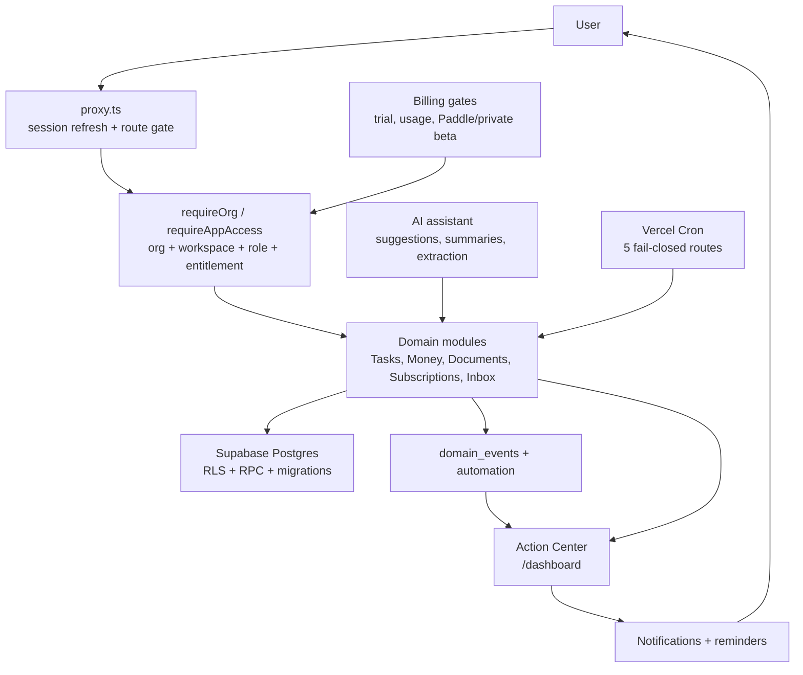
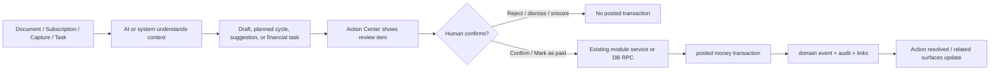
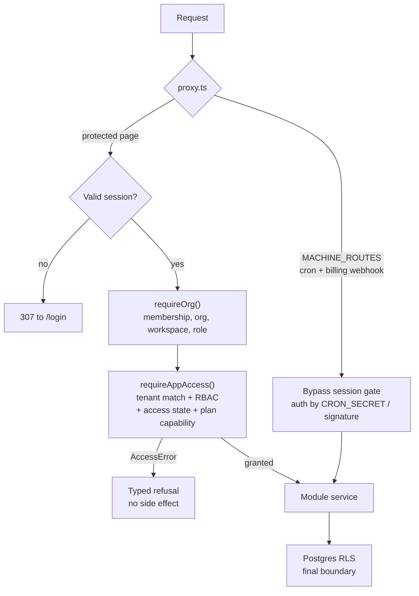
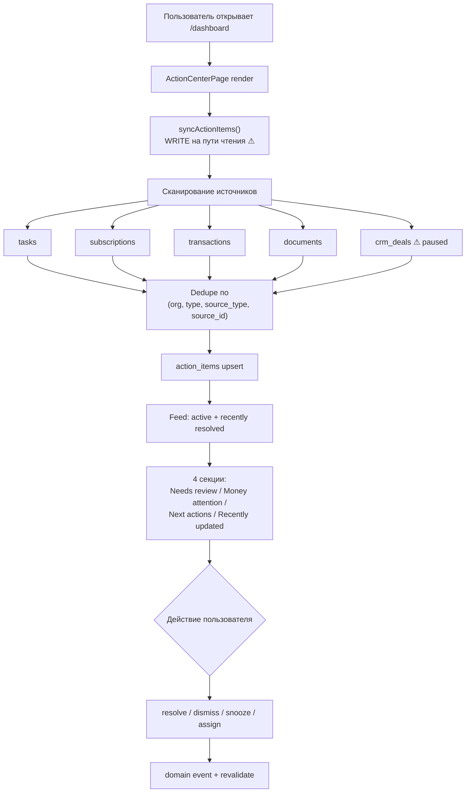
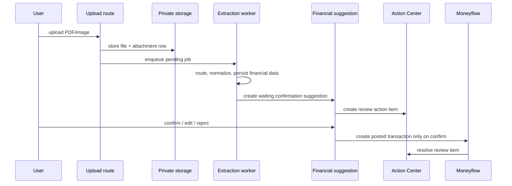
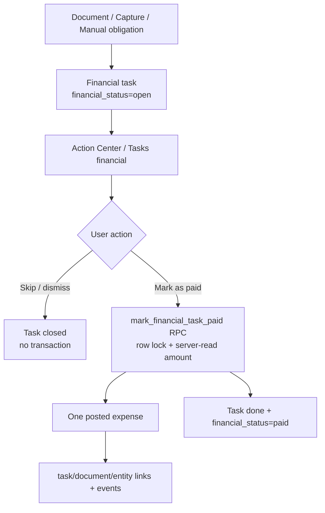
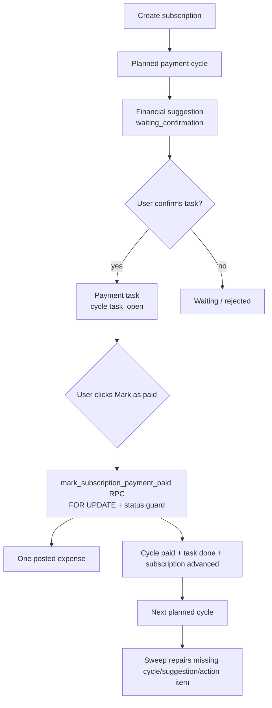
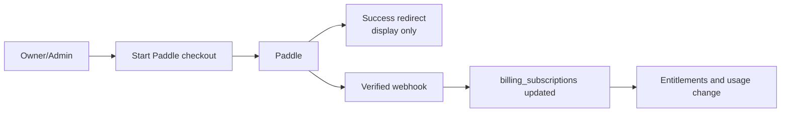
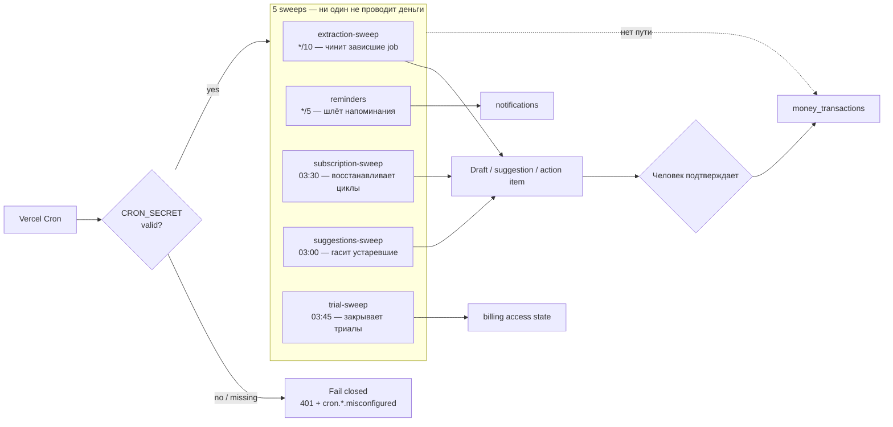
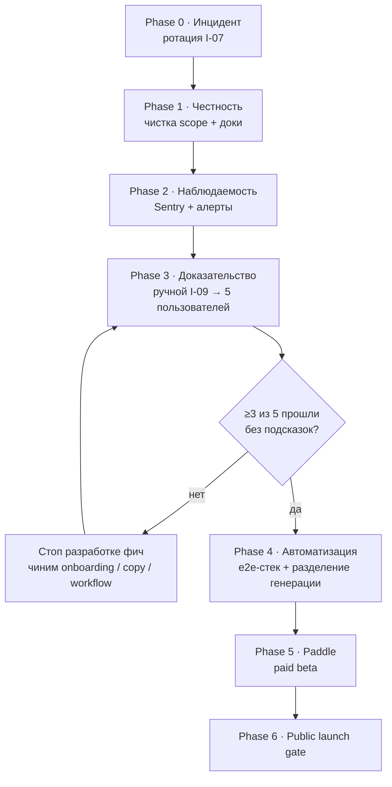

# Nevora Business OS - карта workflows и beta-plan

**Дата исследования:** 2026-07-10  
**Основание:** независимая оценка от 2026-07-10 + сверка с текущим репозиторием.  
**Объём:** полный проект, с фокусом на активный private-beta продукт.

## Вывод

Nevora сейчас ближе всего к **AI-assisted operating desk** для малого бизнеса:
Action Center собирает сигналы, AI и cron создают предложения или черновики, а
финансовые факты появляются только после явного человеческого подтверждения.

Техническая база сильная: 101 миграция, 11 SQL harnesses, 157 test files,
1011 passing tests, RLS как основной tenant-boundary, серверный org/workspace
context, контракты confirm-first finance и notification lifecycle.

Готовность:

| Контур | Статус | Что значит |
|---|---:|---|
| Private beta | ~85% | Основные модули работают, P0/P1 закрыты, unit gates зелёные. |
| Public launch | ~55-60% | Нет машинного e2e, I-09 не выполнен, нет внешней observability/alerts, billing paid-flow не прошёл end-to-end. |

Главный риск не в количестве кода. Главный риск - продукт уже большой, а живые
пользовательские workflows ещё не доказаны на реальных пользователях.

## Evidence

Текущая сверка репозитория:

- `npm test`: **1011 passed / 3 skipped**, 157 files, 6.58s.
- `supabase/migrations`: **101** SQL files, head `101_fix_paddle_boundary_allows_internal.sql`.
- `supabase/tests`: **11** SQL harnesses.
- `app`: **22** route handlers, **50** pages.
- `"use server"` entries: **143** (tracked `*.ts`/`*.tsx`, excluding tests; 147 including tests).
- Cron routes in `vercel.json`: **5**, and all 5 exist under `app/api/cron/`.
- TODO/FIXME hits: **27** (`git grep` over all tracked files; **19** if limited to `app`/`modules`/`features`/`lib`).

Сверка повторена независимо 2026-07-10: `npm test` → 1011 passed / 3 skipped
(157 files), 101 миграция с указанным head, 11 harnesses, 22 route handlers,
50 pages. Расхождений с таблицей выше нет.

Ключевые источники:

- [`docs/ARCHITECTURE.md`](./ARCHITECTURE.md)
- [`docs/MODULE_STATUS.md`](./MODULE_STATUS.md)
- [`docs/contracts/financial-workflows.md`](./contracts/financial-workflows.md)
- [`docs/contracts/notification-lifecycle.md`](./contracts/notification-lifecycle.md)
- [`docs/CAPTURE_INBOX_CONTRACTS.md`](./CAPTURE_INBOX_CONTRACTS.md)
- [`docs/release/release-checklist.md`](./release/release-checklist.md)
- [`docs/release/smoke-test-checklist.md`](./release/smoke-test-checklist.md)
- [`docs/release/p0-p1-issue-register.md`](./release/p0-p1-issue-register.md)
- [`docs/observability/logging-and-errors.md`](./observability/logging-and-errors.md)

## System Map

## Core Invariant

Все денежные workflows строятся вокруг одного правила:

AI suggests. The user confirms. The module service executes. Cron repairs or
expires work, but never posts money.

## Workflows

### 1. Auth, onboarding, org/workspace context

**Entry points:** `/register`, `/login`, `/onboarding`, `/invite/[token]`,
`proxy.ts`, `requireUser()`, `requireOrg()`, `requireAppAccess()`.

Flow:

1. `proxy.ts` refreshes Supabase session and redirects protected routes to login.
2. New user creates organization through onboarding.
3. `requireOrg()` resolves active membership, organization, first workspace and role-derived permissions server-side.
4. `requireAppAccess()` adds tenant mismatch checks, RBAC, billing entitlement and plan capability checks.
5. DB RLS remains the final boundary.

Четыре независимых уровня отказа: proxy, `requireOrg`, `requireAppAccess`, RLS.
Каждый ниже по стеку не доверяет тому, что выше, — поэтому обход одного уровня
не даёт доступа к данным.

Status: **working / core MVP ready**.

Risk:

- Any context regression affects every module.
- Some older Server Actions still use `requireOrg()` + `canDo()` directly. That is not automatically wrong, but public-launch hardening should keep converging on `requireAppAccess()` for paid/write/execute boundaries.

### 2. Action Center daily workflow

**Entry point:** `/dashboard`.

Flow:

1. `/dashboard/page.tsx` renders `ActionCenterPage`.
2. `ActionCenterPage` calls `syncActionItems()` best-effort on render.
3. The generator scans tasks, subscriptions, transactions, documents and currently CRM deals.
4. Candidates are deduped by `(org, type, source_type, source_id)` and written to `action_items`.
5. Feed queries group active items and recently resolved items.
6. User resolves, dismisses, snoozes, assigns, or executes quick actions.
7. Each transition emits `action_item.*` event and revalidates affected surfaces.

Две отмеченные `⚠` ветки — это и есть долг: запись на пути чтения самой
посещаемой страницы, и скан `crm_deals` при том, что CRM на паузе.

Status: **working MVP**, now the primary product surface.

MVP debt:

- `syncActionItems()` writes during render of the most visited page. It is idempotent and soft-failing, but should move to cron/event handlers before public launch.
- `detectDeals()` still scans paused CRM tables. Active relation scope already fails closed for CRM; Action Center should follow that pattern.

### 3. Documents upload -> extraction -> financial review

**Entry points:** `/dashboard/documents`, `/api/documents/upload`,
`runDocumentExtraction()`, financial review actions.

Flow:

Important guarantees:

- Upload uses `requireAppAccess`, storage feature gate and usage limits.
- Extraction can produce normalized data and financial suggestions.
- Extraction itself returns `transactionId: null` and does not post money.
- Confirmation validates account/currency/category and then creates or confirms the transaction.
- Rejecting the suggestion posts nothing.

Status: **working MVP**, needs e2e proof.

Risks:

- No Playwright path for upload -> extract -> confirm.
- Extraction depends on Anthropic/PDF/storage runtime and needs external monitoring.

### 4. Capture Inbox -> AI suggestion -> accepted entity

**Entry point:** `/dashboard/inbox`.

Flow:

1. User captures raw text.
2. `createPlannerEntryAction()` creates `planner_entries`.
3. `processPlannerEntry()` detects intent.
4. The system creates pending `planner_suggestions`.
5. Accepting a suggestion claims it with compare-and-swap status transition.
6. Accepted suggestions route into existing services:
   - standard task -> `createStandardTask`
   - financial task/reminder -> `createFinancialTask`
   - relation -> `createEntityLink`
   - action item -> `createActionItemForDocument`
7. DB unique indexes make accept exactly-once across retry/crash cases.

Status: **working MVP**.

Money invariant:

- Capture Inbox has no direct path to `money_transactions`.
- Financial suggestions become planned obligations/tasks only.

### 5. Tasks and financial tasks

**Entry points:** `/dashboard/tasks`, `/dashboard/tasks/financial`,
task Server Actions, financial task actions.

Standard tasks:

- Create/update/delete/status/assignee/project flows.
- Due dates and open status feed Action Center.
- Completing a normal task posts no money.

Financial tasks:

Status: **working MVP**.

Risk:

- `markFinancialTaskPaidAction` uses `requireOrg()` + `canDo()`, while the RPC enforces `can_write_data()`. This is structurally safe at DB level, but public-launch cleanup should align the action with `requireAppAccess()`.

### 6. Moneyflow

**Entry point:** `/dashboard/money`.

Workflows:

- Accounts: create/update/deactivate.
- Transactions: create/update/delete.
- Transfers: one transfer row and usage reservation.
- Planned transaction: visible in forecasts, excluded from posted ledger until posted.
- Document-sourced drafts: planned -> posted only on confirm.
- Money Intelligence: categorization rules and AI/category suggestions.

Status: **working / most mature active module**.

Important constraints:

- Multi-currency reporting must use historical FX.
- Posting foreign-currency document draft onto a mismatched account is blocked.
- AI category suggestions stay suggestions until confirmed.

### 7. Subscriptions and payment cycles

**Entry point:** `/dashboard/subscriptions`.

Flow:

Status: **working MVP**.

Important guarantees:

- Creating a subscription posts no money.
- Attaching a document posts no money.
- `subscription-sweep` repairs missing planned cycles, review suggestions and Action Center items.
- Mark as paid is idempotent and serializes double clicks in the DB.

Risk:

- Needs runtime e2e for double-click idempotency and schedule advancement.

### 8. Relations and entity graph

**Entry points:** inline relation UI, `createEntityRelation()`,
`createEntityLink()`.

Flow:

1. User or system proposes a link.
2. `createEntityLink()` resolves org context server-side.
3. Source and target are verified inside the active org.
4. Active entity kinds are restricted to task, document, transaction and subscription.
5. Duplicate active links are rejected by partial unique index.
6. Events/audit logs are best-effort.

Status: **in progress, structurally sound**.

Risk:

- Orphan-link sweep is still a follow-up.
- UX is partial across all detail pages.

### 9. Notifications, reminders and read state

**Entry points:** bell UI, push subscriptions, `/api/cron/reminders`.

Flow:

1. Action or reminder creates a notification with deduplication key.
2. In-app notification is inserted.
3. Push delivery checks membership, preferences, quiet hours and VAPID config.
4. Read actions update only `notifications.read_at`.
5. Action Center and obligations stay unresolved until their own business state changes.

Status: **working MVP**.

Invariant:

- Read is not resolved.

Risk:

- Reminder de-dup needs stronger integration proof.
- Browser push requires production smoke with real VAPID config.

### 10. Billing, trials, entitlements and usage

**Current mode:** private beta by default.

Current workflow:

1. Org access state is resolved through billing state.
2. `requireAppAccess()` blocks expired/past-due/unwritable orgs for write/execute flows.
3. Feature gates protect document processing, AI suggestions and storage upload.
4. Usage reservations protect document/task/money/subscription/developer counters.
5. Checkout returns private-beta message unless paid mode is configured.

Future paid workflow:

Status: **partial / private beta honest**.

Gaps:

- **Обработка вебхука реализует формат Stripe, а не Paddle** (заголовок
  `t=,v1=` вместо `ts=;h1=`, signed payload через `.` вместо `:`, конверт
  `id`/`type` вместо `event_id`/`event_type`). Ни одно реальное событие Paddle
  не будет принято. Поскольку платная активация возможна только через webhook,
  платный путь сломан целиком, а не наполовину. Подробности и порядок починки —
  Phase 5.
- Paddle adapter currently returns `url: null`; checkout/portal are not complete.
- Paid activation must remain webhook-only.
- AI and task limits still have mixed legacy/new mechanisms:
  - `generateRecommendationsAction()` uses `featureGateService` + `usageService`.
  - `generateInsightsAction()` and `generateSummaryAction()` still use `checkPlanLimit("ai_calls")`.
  - older todo path still uses legacy limit checks.

### 11. AI assistant

**Entry points:** `/dashboard/ai`, document extraction, Capture Inbox.

Workflows:

- Recommendations: dashboard metrics -> Anthropic -> pending recommendations.
- Insights: dashboard metrics -> Anthropic -> expiring insights.
- Summaries: selected entity -> Anthropic -> cached summary.
- Documents: provider route + normalization -> review suggestion.
- Capture Inbox: intent detection -> planner suggestions.

Status: **partial**.

Rules:

- AI creates suggestions, summaries or drafts.
- AI does not post money and does not autonomously mutate financial facts.

Risk:

- Cost/latency and provider failure need production telemetry.
- Legacy limit paths should converge.
- `generateSummaryAction()` can still fetch paused CRM entities by type map. That should be cut or feature-gated while CRM is paused.

### 12. Analytics

**Entry point:** `/dashboard/analytics`.

Workflow:

1. Reads dashboard metrics, module stats, activity timeline and snapshots.
2. Writes reports/snapshots/widgets through data-write actions.
3. Depends on other modules having enough data.

Status: **partial but real**.

Risk:

- No caching/aggregation yet, query cost will rise with customer data.

### 13. Settings, members and developer access

Workflows:

- Profile/workspace settings update through server actions.
- Member invite/accept/remove with owner guard and billing/member checks.
- Notification preferences configure browser/push behavior.
- Developer access creates API keys and webhooks with usage reservations.
- `/api/v1/me` validates developer API access.

Status: **settings MVP ready, members/developer partial**.

Risk:

- Webhook delivery is registration-only. Creating developer webhooks does not mean payload dispatch exists.

### 14. Cron and background repair

Configured routes:

| Route | Schedule | Purpose | Money posting? |
|---|---:|---|---|
| `/api/cron/extraction-sweep` | every 10 min | recover stuck extraction jobs | no |
| `/api/cron/reminders` | every 5 min | process due reminders | no |
| `/api/cron/subscription-sweep` | daily 03:30 | repair subscription cycles/suggestions | no |
| `/api/cron/suggestions-sweep` | daily 03:00 | expire stale AI/suggestions | no |
| `/api/cron/trial-sweep` | daily 03:45 | consume expired trials | no |

Cron чинит и просрочивает работу, но проведённая транзакция появляется только
после явного подтверждения человеком. Это тот же инвариант, что и у AI.

Status: **working structurally**.

Risk:

- Routes fail closed on missing/invalid `CRON_SECRET`, but there is no external alerting if a job starts failing.
- Prior history included proxy redirecting machine routes to login. `MACHINE_ROUTES` now includes cron and billing webhook paths; keep tests around it.

### 15. Release and operations

Workflows:

- Local gates: typecheck, lint, test, build.
- CI also applies migrations on clean Postgres and runs SQL harnesses.
- Release checklist covers scope gates, financial invariants, cron auth, smoke and go/no-go.
- Runbooks cover tenant leak, cron failure, extraction stuck, upload failure, missing Action Center item, billing mismatch, usage drift and rollback.

Status: **strong docs and runbooks, weak live signals**.

Gap:

- Structured logging exists, but no Sentry/OpenTelemetry/alerting dependency is present. `diagnosticId` helps only after someone has the logs.

### 16. Paused modules: Booking and CRM

Current workflow:

1. Pages call paused-module guards.
2. Server Actions reject through `assertPausedModuleAction()`.
3. Booking route handlers return 404 through `pausedModuleGuard()`.
4. Migration `098` closed Booking anon read/write DB surface.
5. Relations config refuses CRM kinds.

Status: **paused and mostly hard-gated**.

Residual cleanup:

- `MODULE_STATUS.md` still contains an old Booking warning block that contradicts the top of the same file.
- `ActionCenter` still scans CRM deals.
- `generateSummaryAction()` still maps `deal` and `client` entity types.
- Decide whether Booking/CRM get a reactivation date or are moved out of active tree.

## Workflow Readiness Matrix

| Workflow | Status | Confidence | Release note |
|---|---|---:|---|
| Auth/org/workspace context | Working | High | Needs e2e for registration/onboarding. |
| Action Center daily screen | Working MVP | Medium | Move generation out of render path. |
| Documents upload/extraction/review | Working MVP | Medium | Needs deployed smoke and failure monitoring. |
| Confirm document expense | Working structurally | Medium | No machine e2e yet. |
| Capture Inbox | Working MVP | Medium | Good money-safety model. |
| Standard tasks | Working | High | Legacy create-todo path should retire. |
| Financial tasks Mark as paid | Working structurally | Medium | Align action gate, add e2e double-click. |
| Money accounts/transactions/transfers | Working | High | Keep FX and currency constraints enforced. |
| Subscription payment cycles | Working MVP | Medium | Needs e2e for mark-paid idempotency and schedule. |
| Relations/entity links | In progress | Medium | Active scope is correct; UX partial. |
| Notifications/reminders | Working MVP | Medium | Needs reminder de-dup and push smoke. |
| Billing private beta | Working | Medium | Honest private-beta state. |
| Paddle paid billing | **Broken** | Low | Webhook verifies a Stripe-format signature; no real Paddle event is accepted. Checkout/portal return `url: null`. DB idempotency (`092`) is sound. |
| AI insights/recs/summaries | Partial | Medium | Mixed limit mechanisms. |
| Analytics | Partial | Medium | Needs caching later. |
| Cron repair jobs | Working structurally | Medium | No external alerting. |
| Release/ops docs | Strong | High | Some docs stale; runbooks lack alert trigger. |
| CRM/Booking paused scope | Mostly closed | Medium | Clean residual code paths and stale docs. |

## Plan

Порядок фаз подчинён одному правилу: **самый дешёвый шаг, способный отменить
последующие, выполняется первым.** Пять живых пользователей могут обесценить
Playwright и Paddle, поэтому они стоят до них, а не после.

Каждый пункт требует владельца и даты. Пункт без владельца не выполняется.

### Phase 0 - прямо сейчас

Goal: закрыть инцидент. Занимает минуты и ничего не блокирует.

1. Rotate leaked payment test key (I-07).

Ротация выполняется **до** того, как кто-либо снова пойдёт по задеплоенному
окружению. Это инцидент, а не пункт списка задач.

### Phase 1 - honest scope

Goal: привести репозиторий и доки в состояние, которое не придётся
перепроверять после следующего шага.

Выполняется **до** ручного smoke: удаление CRM-скана меняет набор элементов в
Action Center, иначе smoke придётся гонять дважды.

1. Remove active-scope leaks:
   - delete or feature-gate `detectDeals()` in Action Center while CRM is paused
     (`modules/action-center/services/action-item-generator.ts:70`);
   - remove or gate `deal`/`client` from AI summary entity map while CRM is
     paused (`modules/ai/actions/generate-summary.action.ts:137`).
2. Fix the obvious stale docs:
   - README migration head and module table;
   - README env vars for `CRON_SECRET`, `BILLING_MODE`, `BILLING_PROVIDER`, Paddle vars;
   - ~~`MODULE_STATUS.md` old Booking warning block~~ — **done 2026-07-10**: блок
     утверждал, что `anon`-утечка открыта, и предлагал закрыть её миграцией `094`,
     тогда как `098` уже закрыла её и это зафиксировано в том же файле выше;
   - `OPERATIONS_MANUAL.md` and `ROADMAP.md` migration baseline drift.

### Phase 2 - observability before proof

Goal: сделать следующий шаг наблюдаемым. Ручной прогон по неинструментированному
окружению не даёт доказательства — только впечатление.

1. Add external observability:
   - Sentry or OpenTelemetry/log drain;
   - alert on `cron.*.threw`, `cron.*.misconfigured`, upload/extraction failures,
     billing webhook failures, 5xx rate.

### Phase 3 - proof, then people

Goal: доказать, что основной цикл работает, и узнать, нужен ли он кому-то.

Это фаза, ради которой существуют предыдущие три. Она может отменить Phase 4-5.

1. Run I-09 manually on deployed environment, **once**:
   - register -> onboarding -> org -> dashboard;
   - upload -> extract -> review -> confirm transaction;
   - reject document suggestion;
   - mark financial task paid twice;
   - mark subscription cycle paid twice;
   - cross-org direct-ID access;
   - notification read does not resolve;
   - Capture Inbox accept/reject.

   **Evidence contract** (без него пункт не считается закрытым): на каждый
   сценарий — запись экрана либо скриншот конечного состояния, `diagnosticId`
   любой возникшей ошибки, и SQL-выборка, подтверждающая денежный инвариант
   (ровно одна `money_transactions` строка после двойного клика).

2. Пять живых пользователей проходят таблицу из **Product Proof** ниже.

   Если меньше трёх из пяти проходят без подсказок — **остановить разработку
   фич** и чинить onboarding/copy/ясность workflow. Phase 4 и Phase 5 при этом
   не начинаются.

### Phase 4 - repeatable checks

Goal: зафиксировать тестами то, что уже прошло руками и людьми.

Начинается только после того, как Phase 3 дала положительный сигнал.

> **Сверено с кодом 2026-07-10.** Три из пяти пунктов были описаны неверно — в
> том числе один, переписанный в этом же документе. Формулировки ниже проверены
> чтением исходников, а не памятью. Ошибки плана систематичны: он неточен ровно
> там, где описывает код, которого не читал.

1. **Поднять e2e-стек** и покрыть им пять сценариев Phase 3.

   Пункт был недооценён: Playwright **не установлен вообще** — нет пакета в
   `package.json`, нет конфига, каталога `e2e/`, фикстуры авторизации, посева
   тестовой организации, CI-джобы. Сами сценарии уже перечислены в Phase 3, так
   что работа не в них, а в харнессе: авторизованная сессия, изолированная org,
   выбор цели (локально или задеплоенное окружение), сброс данных между
   прогонами.

   Сценарии — те же пять, что прошли вручную:
   - registration/onboarding/dashboard;
   - document upload -> extraction -> confirm expense;
   - subscription mark-as-paid double-click;
   - cross-org safe not-found;
   - Capture Inbox suggestion accept.

2. **Разделить генерацию `action_items` по природе сигнала.**

   Ни «перенести сканер в cron» (исходный план), ни «удалить сканер, всё
   событийно» (первая правка этого документа) не верны. Обе формулировки теряют
   часть сигналов.

   Три из восьми сигналов возникают **от хода времени, а не от записи** — в
   момент, когда они становятся истинными, никакой записи в БД не происходит,
   и обработчику события не на что реагировать:

   | Сигнал | Условие | Источник |
   |---|---|---|
   | `overdue` | `due_date < today` | часы |
   | `due_soon` | `due_date <= today + 3` | часы |
   | `renewal_required` | `next_billing_date` в пределах 7 дней | часы |

   Остальные пять (`assignment_required`, `missing_relation`, неиспользуемая
   подписка, транзакция без связи, документ в статусе `draft`) возникают от
   записи и покрываются событийно.

   Поэтому:
   - **событийная запись** для сигналов состояния — это чинит свежесть главного
     экрана: созданная задача появляется сразу, а не после следующего cron;
   - **плановый скан** для временных сигналов — гранулярность в днях, ночного
     прогона достаточно; нужен новый cron-route (ни один из пяти существующих
     не генерирует `action_items`), секрет, алерт на падение;
   - убрать сканер с пути рендера **после** того, как оба пути закрыты, не до;
   - сохранить ручной refresh action.

   Образец cron-реконсилятора уже есть: `sweep-subscription-payment-workflow.ts`
   пишет `action_items` (строка ~165). Копировать его, не изобретать.

   ⚠ Инвариант «на рендере не пишем» нельзя вводить буквально: на рендере
   Action Center пишет также `reconcileFirstAction()`
   (`modules/onboarding/queries/get-wizard-state.ts:42`), и на этом держится
   воронка активации. Ограничение касается сканера, а не всех записей.

   ⚠ Отдельно (не в объёме пункта, но обнаружено при сверке): ключ дедупликации
   — `(org, type, source_type, source_id)`, а `due_soon` и `overdue` это разные
   `type`. Когда задача пересекает срок, появляется второй item, и старый
   `due_soon` никто не гасит. Вероятный источник шума в ленте.

3. **Свести две параллельные системы квот AI.**

   План утверждал, что `generateInsights`/`generateSummary` «всё ещё на легаси
   `checkPlanLimit`». Это не так: оба уже вызывают
   `requireAppAccess({ capability: "ai_calls" })`, который **сам внутри** зовёт
   `checkPlanLimit` (`lib/security/require-app-access.ts:140`). Прямой вызов
   ниже — безвредный дубль: `checkPlanLimit` — чистое чтение, квоту не
   расходует.

   Настоящее расхождение план не заметил. Расход AI считается **по-разному** в
   зависимости от действия:

   | Действие | Гейт доступа | Учёт расхода |
   |---|---|---|
   | `generateRecommendations` | `requireAppAccess` | `featureGateService` + `usageService.assertWithinLimit("ai_suggestions_monthly")` |
   | `generateInsights` | `requireAppAccess` | только триггер БД на `ai_requests` |
   | `generateSummary` | `requireAppAccess` | только триггер БД на `ai_requests` |
   | `categorizeTransaction` | `requireOrg()` ⚠ | только `checkPlanLimit` |

   Это вопрос корректности биллинга, а не косметика. Работа:
   - привести `generateInsights`/`generateSummary` к паттерну
     `generateRecommendations` (feature gate + учёт расхода), либо осознанно
     оставить триггер БД единственным счётчиком — но одинаково для всех трёх;
   - перевести `categorizeTransaction` с `requireOrg()` на `requireAppAccess()`;
   - удалить дублирующий прямой `checkPlanLimit` там, где выше уже стоит
     `requireAppAccess` с той же capability.

4. **Довести до рантайма то, что уже покрыто unit-тестами.**

   Пункт съёживается: оба «недостающих» утверждения уже существуют.

   - двойной клик по оплате — `mark-subscription-payment-as-paid.test.ts:117`
     («is idempotent: an already-paid cycle creates no new expense») и
     `test/release-invariants.test.ts:102`;
   - повторное извлечение после подтверждения —
     `create-draft-transaction-from-document.test.ts:103`
     («returns already_confirmed and inserts nothing»).

   Не хватает не утверждений, а прогона в рантайме — он приходит вместе с
   e2e-стеком из пункта 1. Остаётся дописать только retry extraction after
   failure.

5. **Сделать rate limiter fail-loud** (низкий приоритет).

   Реальная поверхность сегодня — один роут `/api/v1/me`: три остальных
   вызывающих (`api/public/booking/*`) отдают 404, пока Booking на паузе.
   Кроме того `checkRateLimit()` возвращает `FAIL_OPEN` не только при
   отсутствующем `SUPABASE_SERVICE_ROLE_KEY`, но и на любой ошибке RPC
   (`lib/rate-limit/rate-limit.ts:59+`) — закрытие только по ключу закроет
   меньшую часть дыры, чем кажется. «Fail startup» не выбирать: это
   самостоятельно устроенный отказ. Логировать и алертить, блокировать —
   только защищённые публичные эндпоинты.

6. **Удалить легаси-путь создания задач** — или провести его через те же
   атомарные сервисы.

   Это не удаление мёртвого кода: `features/todos/actions/create-todo.action.ts`
   вызывается из живой UI-формы `features/todos/components/todo-form.tsx`,
   из route handler `app/api/tasks/[taskId]/document/route.ts` и из
   `modules/documents/services/create-task-document-with-attachments.ts`.
   Рефакторинг с UI-поверхностью, а не чистка.

### Phase 5 - paid beta readiness

Goal: make money-in/product-out billing real.

Начинается только если Phase 3 дала ≥3 из 5. Строить платный биллинг для
продукта, чей основной цикл ещё никто не прошёл, — оплата опциона, который
может не понадобиться.

> **Сверено с кодом и документацией Paddle 2026-07-10.** Порядок пунктов был
> опасен, а пункт 4 назван «проверить» там, где требуется переписать. Код
> верификации вебхуков реализует формат **Stripe**, а не Paddle.

**Webhook чинится первым, checkout — вторым.** Исходный план начинался с
checkout, то есть с видимой половины. Но checkout поверх нерабочего вебхука даёт
худший из возможных исходов: пользователь платит, а план не включается. Платная
активация по замыслу возможна **только** через webhook (пункт 4 ниже) — значит
он и есть критический путь.

1. **Переписать обработку вебхука Paddle.** Сейчас она не примет ни одного
   реального события — ломается на четырёх независимых уровнях:

   | Уровень | Код ожидает | Paddle присылает |
   |---|---|---|
   | Заголовок | `t=<ts>,v1=<hex>` (запятая) | `ts=<ts>;h1=<hex>` (точка с запятой) |
   | Signed payload | `${ts}.${rawBody}` (точка) | `${ts}:${rawBody}` (двоеточие) |
   | Конверт события | `id`, `type`, `created` | `event_id`, `event_type`, `occurred_at` |
   | Привязка | `data.organizationId`, `data.planCode` | организация в `custom_data`, план как `items[].price.id` |

   Первый уровень отвергает 100% настоящих вебхуков: `header.split(",")` даёт
   одну часть, `parts.t` — `undefined`, функция возвращает `false`
   (`modules/billing/services/billing-webhook.ts:151`).

   Обратного маппинга `price_id → plan` в проекте нет — есть только прямой,
   `paddlePriceIdForPlan`. Его нужно добавить.

   Отказ **молчалив**: route отвечает 401, Paddle ретраит и сдаётся, локально не
   активируется ничего. Ровно тот класс, что закрывал I-10 (proxy разворачивал
   вебхуки на `/login`, платные события терялись). Логирование есть
   (`billing.webhook.rejected`), но увидеть его будет некому до Phase 2.

   ⚠ **Тест проходит вхолостую.** `billing-webhook.test.ts:23` сам строит
   заголовок как `` `t=${timestamp},v1=${signature}` `` — то есть проверяет
   верификатор против его же конвенции. Новый тест обязан подавать **фикстуру
   настоящего заголовка Paddle**, а не конструировать её тем же кодом, что
   проверяет. Иначе он снова ничего не докажет.

   Обманчиво и то, что адаптер читает заголовок под верным именем
   (`headers.get("paddle-signature")`): снаружи Paddle-осведомлён, внутри Stripe.

2. **Прогнать sandbox-события Paddle** и убедиться, что событие доходит до
   `apply_billing_provider_event`.

   Идемпотентность **уже реальна и работы не требует**: миграция `092` даёт
   `UNIQUE(provider, provider_event_id)` + `ON CONFLICT DO NOTHING`, RPC
   вызывается по `providerEventId`. Paddle гарантирует at-least-once и сам
   советует дедуплицировать по `event_id` — механизм готов, в него просто
   никогда не доходит событие.

3. Implement Paddle checkout URL creation in `PaddleBillingAdapter`
   (сейчас возвращает `url: null`, `modules/billing/services/paddle-billing.adapter.ts:44`;
   к API Paddle не обращается вовсе).
4. Implement Customer Portal session (там же, `:53` — тоже `url: null`).
5. Keep success redirect display-only.

   Сейчас требование **пусто**: `returnUrl` вычисляется и передаётся в адаптер,
   который его игнорирует; обработчика success не существует. Сохранять нечего —
   пункт становится актуальным вместе с пунктом 3.

6. Add reconciliation/reporting workflow for provider/local mismatch.
   Не существует ничего; план прав.
7. Run smoke in `BILLING_MODE=paid_beta` before exposing checkout.
   Гейт реален: `create-checkout-session.action.ts:86` отсекает `private_beta`.
8. **Rollback plan для каждой миграции этой фазы.** Миграции `100`/`101` уже
   один раз положили создание организации: `100` ввела paddle-only CHECK,
   который отверг `DEFAULT 'manual'`, и `create_organization` откатывался.
   Ни одна миграция биллинг-границы не выкатывается без проверенного отката.

Источники по формату Paddle:
[signature verification](https://developer.paddle.com/webhooks/signature-verification),
[how webhooks work](https://developer.paddle.com/webhooks/about/how-webhooks-work/).

### Phase 6 - public launch gate

Goal: no public launch until behavior is proven.

Public launch remains **No-Go** until:

- I-07 and I-09 are closed with evidence.
- Playwright covers the five critical workflows.
- Observability alerts are live and tested.
- Cron jobs have at least one clean cycle after deploy.
- Rate limiter no longer silently fails open in production.
- Docs match the repository and remote database state.
- At least five real beta users have run the core workflow with their own data
  (закрывается в Phase 3, не здесь — к этому гейту пункт уже должен быть выполнен).
- Backup/restore проверены на восстановление живых пользовательских данных.

## Product Proof

Материал для **Phase 3, пункт 2**. Следующая продуктовая веха — не ещё один
модуль, а пять живых пользователей, прошедших таблицу ниже.

| User proof | Success signal | Why it matters |
|---|---|---|
| Upload a real receipt/invoice | User confirms or rejects the suggestion | Proves document workflow and trust. |
| Add a real subscription | User sees next payment action | Proves recurring obligation model. |
| Mark a real payment paid | One expense, no duplicate | Proves confirm-first money loop. |
| Capture a messy note | User accepts an AI suggestion | Proves Inbox as a natural input. |
| Open Action Center next day | User understands what to do | Proves the product promise. |

Правило остановки: если меньше трёх из пяти проходят это без подсказок —
остановить разработку фич и чинить onboarding/copy/ясность workflow. Phase 4 и
Phase 5 не начинаются.

Осознанный компромисс: пять пользователей идут по коду, ещё не покрытому
Playwright. Это принято сознательно — они пройдут по нему в любом случае, вопрос
лишь в том, случится это до или после работы, которую их фидбэк может отменить.

## Documentation Plan

Use this document as the workflow index. Then split only if the docs grow:

- `docs/workflows/document-to-money.md`
- `docs/workflows/subscription-payment-cycle.md`
- `docs/workflows/capture-inbox.md`
- `docs/workflows/action-center-generation.md`
- `docs/workflows/billing-private-to-paid-beta.md`

For now, one workflow map is better: the value of Nevora is cross-module, so the
reader needs to see the connective tissue in one place.
